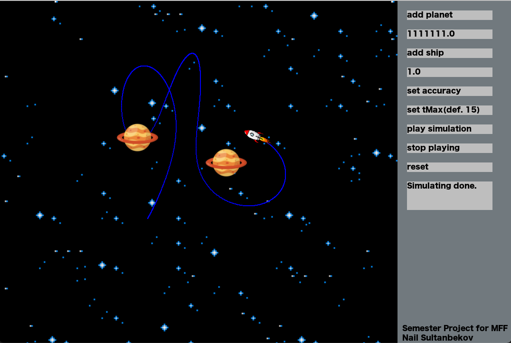
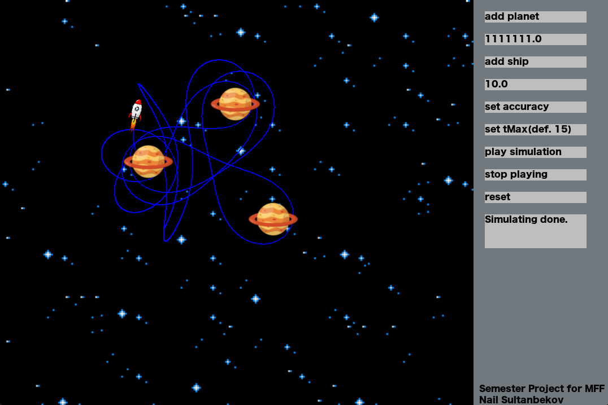

# GravitationalMotionSimulator

 Simulator of gravitational motion with fixed planets.

## How to launch:
#### From Source
Run the `main.py` file from repository root.

## Dependencies
If running from source then dependencies can be installed with 

`pip3 install -U pygame --user` +
`pip3 install -U pygame_textinput --user`.

## Screenshots

## How to launch simulation:
Firstly, set the masses of the planets and of the ship. The regular values of mass parameters for planets are around 10^5 - 10^6, and for the ship, they range from 1 to 10. Next, arrange your units on the playing window. You can also set the accuracy and time(tMax) for simulating.

Once you've done that, click the `play simulation` button. The time it takes for the calculations can vary from a few seconds to one minute. After the calculations are complete, your simulation will start. While playing the simulation, you can click the `stop playing` button or the `reset` button.

Please note that during the simulation or when it's stopped, you cannot change or add new units. To do this, you'll need to wait for the simulation to end or click the `reset` button, which will delete all units. 

You can change positions of the units. To do this you have to click to your unit and drag to new replacement. If you want to change the mass of the unit just click on it and write new mass to the mass input window. 